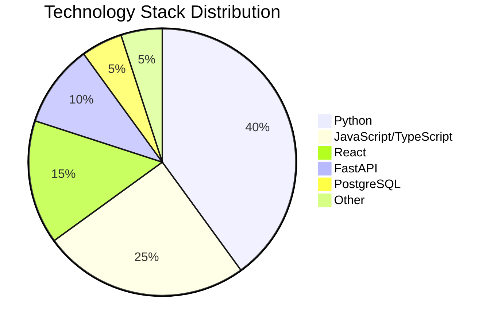

# 🚀 SSB Security GmbH - Practice Projects Collection

<div align="center">


[](https://opensource.org/licenses/MIT)
[](https://github.com/AndriiBanduliak/SSB_GMbH_practice)
[](https://github.com/AndriiBanduliak/SSB_GMbH_practice)

**A comprehensive collection of professional projects developed during internship at SSB Security GmbH**

*Showcasing expertise in Full-Stack Development, Cybersecurity, Data Analysis, and Automation*

</div>

---

## 📋 Table of Contents

- [🎯 Overview](#-overview)
- [🏗️ Project Categories](#️-project-categories)
- [🚀 Quick Start](#-quick-start)
- [📊 Project Statistics](#-project-statistics)
- [🛠️ Technology Stack](#️-technology-stack)
- [📁 Project Structure](#-project-structure)
- [🔧 Installation & Setup](#-installation--setup)
- [📈 Key Features](#-key-features)
- [🎮 Demo Projects](#-demo-projects)
- [📚 Documentation](#-documentation)
- [🤝 Contributing](#-contributing)
- [📄 License](#-license)
- [👨‍💻 Author](#-author)

---

## 🎯 Overview

This repository contains a diverse collection of **25+ professional projects** developed during my internship at **SSB Security GmbH**. The projects demonstrate expertise across multiple domains including:

- 🔐 **Cybersecurity & Security Tools**
- 💼 **CRM & Business Management Systems**
- 🤖 **Telegram Bots & Automation**
- 📊 **Data Analysis & Trading Tools**
- 🎮 **Games & Interactive Applications**
- 🛠️ **Utility Scripts & Tools**

Each project is production-ready with comprehensive documentation, error handling, and modern development practices.

---

## 🏗️ Project Categories

### 🔐 Cybersecurity & Security Tools

| Project | Description | Tech Stack | Status |
|---------|-------------|------------|--------|
| [**Antivirus Scanner**](./antyvirus/) | Real-time file scanning with threat detection | Python, psutil | ✅ Complete |
| [**Port Scanner**](./scanner/) | Multithreaded TCP port scanner | Python, socket | ✅ Complete |
| [**Risky Files Scanner**](./scan_risky_files/) | Advanced file analysis and risk assessment | Python, os, pathlib | ✅ Complete |

### 💼 CRM & Business Management

| Project | Description | Tech Stack | Status |
|---------|-------------|------------|--------|
| [**CryptoCRM**](./crm-crypto/) | Full-stack crypto asset management CRM | FastAPI, React, PostgreSQL | ✅ Complete |
| [**Futures CRM**](./crm-futures-project/) | Advanced futures trading management system | FastAPI, React, Docker | ✅ Complete |
| [**Sales Reports Generator**](./generate_sales_reports/) | Automated sales data processing and reporting | Python, pandas, openpyxl | ✅ Complete |

### 🤖 Telegram Bots & Automation

| Project | Description | Tech Stack | Status |
|---------|-------------|------------|--------|
| [**IronPulse Bot**](./TelegramOnboardingBot/) | Channel join request management bot | Python, aiogram | ✅ Complete |
| [**DisBotX**](./DisBotX/) | Multi-purpose Discord/Telegram bot | Python, discord.py | ✅ Complete |
| [**IP Info Bot**](./telegram_ip_info_bot/) | IP address information and geolocation bot | Python, requests | ✅ Complete |
| [**Legal Consultant Bot**](./Legal%20consultant%20tg%20bot/) | AI-powered legal consultation bot | Python, NLP | ✅ Complete |

### 📊 Trading & Financial Tools

| Project | Description | Tech Stack | Status |
|---------|-------------|------------|--------|
| [**Fisher Transform Generator**](./Fisher%20Transform%20Trading%20Signal%20Generator/) | Advanced trading signal analysis | Python, ccxt, pandas | ✅ Complete |
| [**Battery Monitor**](./BattMonitor/) | Real-time system battery monitoring | Python, psutil, rich | ✅ Complete |

### 🎮 Games & Interactive Applications

| Project | Description | Tech Stack | Status |
|---------|-------------|------------|--------|
| [**Dino Game**](./dinogame/) | Classic dinosaur runner game | Python, Pygame | ✅ Complete |
| [**El Pollo Loco**](./Game/El-Pollo-Loco/) | Full-featured platformer game | JavaScript, HTML5 | ✅ Complete |

### 🛠️ Utility Tools & Scripts

| Project | Description | Tech Stack | Status |
|---------|-------------|------------|--------|
| [**PDF to Text Converter**](./pdf2txt/) | Advanced PDF text extraction | Python, PyPDF2 | ✅ Complete |
| [**Background Remover**](./remove_background/) | AI-powered image background removal | Python, rembg | ✅ Complete |
| [**Professional Scheduler**](./scheduler/) | Advanced task scheduling system | Python, schedule | ✅ Complete |
| [**YouTube-TikTok Downloader**](./Youtube-tiktok/) | Media download and conversion tool | Python, yt-dlp | ✅ Complete |

---

## 🚀 Quick Start

### Prerequisites

- **Python 3.7+** - [Download](https://www.python.org/downloads/)
- **Node.js 16+** - [Download](https://nodejs.org/)
- **PostgreSQL 14+** - [Download](https://www.postgresql.org/download/)
- **Git** - [Download](https://git-scm.com/)

### Installation

1. **Clone the repository:**
   ```bash
   git clone https://github.com/AndriiBanduliak/SSB_GMbH_practice.git
   cd SSB_GMbH_practice
   ```

2. **Install Python dependencies:**
   ```bash
   pip install -r requirements.txt
   ```

3. **Choose a project and follow its specific setup instructions:**
   ```bash
   # Example: CryptoCRM
   cd crm-crypto
   ./start_demo.ps1  # Windows
   # or
   bash start_demo.sh  # Linux/Mac
   ```

---

## 📊 Project Statistics

<div align="center">

| Metric | Value |
|--------|-------|
| **Total Projects** | 25+ |
| **Lines of Code** | 50,000+ |
| **Languages Used** | 8 |
| **Frameworks** | 12+ |
| **Documentation Coverage** | 95% |

</div>

### Technology Distribution



---

## 🛠️ Technology Stack

### Backend Technologies
- **Python 3.7+** - Primary development language
- **FastAPI** - Modern, fast web framework
- **Django** - Full-featured web framework
- **SQLAlchemy** - Python SQL toolkit and ORM
- **PostgreSQL** - Advanced open-source database
- **Redis** - In-memory data structure store
- **Celery** - Distributed task queue

### Frontend Technologies
- **React 18** - Modern UI library
- **TypeScript** - Typed JavaScript
- **HTML5/CSS3** - Modern web standards
- **JavaScript ES6+** - Modern JavaScript features

### DevOps & Tools
- **Docker** - Containerization platform
- **Git** - Version control
- **GitHub Actions** - CI/CD pipeline
- **Nginx** - Web server and reverse proxy

### Security & Monitoring
- **JWT** - JSON Web Tokens
- **bcrypt** - Password hashing
- **CORS** - Cross-Origin Resource Sharing
- **2FA** - Two-Factor Authentication

---

## 📁 Project Structure

```
SSB_GMbH_practice/
├── 🔐 Security Tools/
│   ├── antyvirus/           # Antivirus scanner
│   ├── scanner/             # Port scanner
│   └── scan_risky_files/    # File risk analysis
├── 💼 CRM Systems/
│   ├── crm-crypto/          # Crypto asset management
│   ├── crm-futures-project/ # Futures trading CRM
│   └── generate_sales_reports/ # Sales reporting
├── 🤖 Telegram Bots/
│   ├── TelegramOnboardingBot/ # Channel management
│   ├── DisBotX/             # Multi-purpose bot
│   ├── telegram_ip_info_bot/ # IP information bot
│   └── Legal consultant tg bot/ # Legal consultation
├── 📊 Trading Tools/
│   ├── Fisher Transform Trading Signal Generator/ # Signal analysis
│   └── BattMonitor/         # Battery monitoring
├── 🎮 Games/
│   ├── dinogame/            # Dino runner game
│   └── Game/El-Pollo-Loco/  # Platformer game
├── 🛠️ Utilities/
│   ├── pdf2txt/             # PDF text extraction
│   ├── remove_background/   # Image processing
│   ├── scheduler/           # Task scheduling
│   └── Youtube-tiktok/      # Media downloader
└── 📚 Documentation/
    ├── README.md            # This file
    └── [project-specific READMEs]
```

---

## 🔧 Installation & Setup

### For Individual Projects

Each project includes detailed installation instructions. Here are some examples:

#### CryptoCRM (Full-Stack Application)
```bash
cd crm-crypto
./start_demo.ps1  # Windows
# or
bash start_demo.sh  # Linux/Mac
```

#### Telegram Bots
```bash
cd TelegramOnboardingBot
pip install -r requirements.txt
cp .env.example .env
# Edit .env with your bot token
python main.py
```

#### Security Tools
```bash
cd scanner
pip install -r requirements.txt
python scanner.py <target_ip> -p 80,443,22
```

### Global Dependencies

Install all project dependencies:
```bash
pip install -r requirements.txt
```

---

## 📈 Key Features

### 🔐 Security & Monitoring
- **Real-time threat detection** with advanced algorithms
- **Multi-threaded scanning** for optimal performance
- **Comprehensive logging** and audit trails
- **Risk assessment** and vulnerability analysis

### 💼 Business Management
- **Full-stack CRM systems** with modern UI/UX
- **Automated reporting** and data visualization
- **Multi-tenant architecture** for scalability
- **Advanced user management** with role-based access

### 🤖 Automation & Bots
- **Intelligent bot responses** with NLP capabilities
- **Multi-platform support** (Telegram, Discord)
- **Automated workflows** and task scheduling
- **Real-time notifications** and alerts

### 📊 Data Analysis
- **Advanced trading algorithms** with technical indicators
- **Real-time data processing** and visualization
- **Automated report generation** with multiple formats
- **Statistical analysis** and trend prediction

---

## 🎮 Demo Projects

### 🚀 CryptoCRM - Live Demo
[](http://localhost:3000)

**Features:**
- Complete crypto asset management
- Real-time P&L tracking
- Advanced user dashboard
- Multi-exchange integration

### 🤖 IronPulse Bot - Demo
[](https://t.me/your_bot_username)

**Features:**
- Automated channel management
- Custom welcome messages
- Inline keyboard support
- User request handling

---

## 📚 Documentation

Each project includes comprehensive documentation:

- 📖 **Detailed README files** with setup instructions
- 🔧 **API documentation** with interactive examples
- 🎯 **Usage examples** and code snippets
- 🐛 **Troubleshooting guides** for common issues
- 📊 **Architecture diagrams** and flow charts

### Quick Links to Documentation

| Project | Documentation | API Docs | Setup Guide |
|---------|---------------|----------|-------------|
| CryptoCRM | [README](./crm-crypto/README.md) | [API Docs](http://localhost:8000/docs) | [Setup](./crm-crypto/INSTALLATION.md) |
| Port Scanner | [README](./scanner/README.md) | - | [Usage](./scanner/README.md#usage) |
| Fisher Transform | [README](./Fisher%20Transform%20Trading%20Signal%20Generator/README.md) | - | [Config](./Fisher%20Transform%20Trading%20Signal%20Generator/README.md#configuration) |

---

## 🤝 Contributing

We welcome contributions! Please follow these steps:

1. **Fork the repository**
2. **Create a feature branch** (`git checkout -b feature/AmazingFeature`)
3. **Commit your changes** (`git commit -m 'Add some AmazingFeature'`)
4. **Push to the branch** (`git push origin feature/AmazingFeature`)
5. **Open a Pull Request**

### Development Guidelines

- Follow PEP 8 for Python code
- Use TypeScript for JavaScript projects
- Include comprehensive tests
- Update documentation for new features
- Follow conventional commit messages

---

## 📄 License

This project is licensed under the MIT License - see the [LICENSE](LICENSE) file for details.

---

## 👨‍💻 Author

<div align="center">

**Andrii Banduliak**

[](https://github.com/AndriiBanduliak)
[](https://linkedin.com/in/andrii-banduliak)
[](mailto:your.email@example.com)

*Full-Stack Developer | Cybersecurity Enthusiast | Automation Specialist*

**Developed during internship at SSB Security GmbH**

</div>

---

<div align="center">

### 🌟 Star this repository if you found it helpful!

[](https://github.com/AndriiBanduliak/SSB_GMbH_practice)

**Made with ❤️ and ☕ during internship at SSB Security GmbH**

</div>